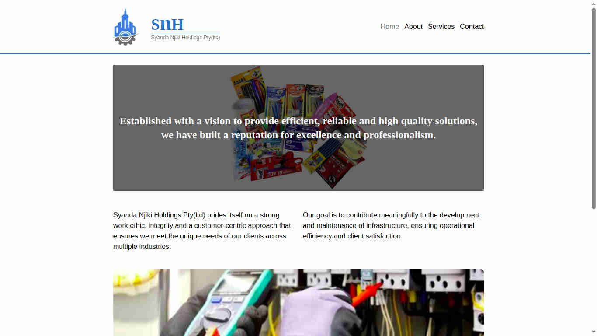
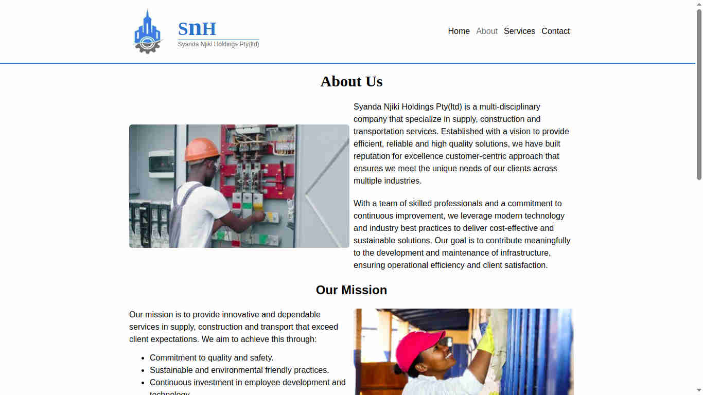
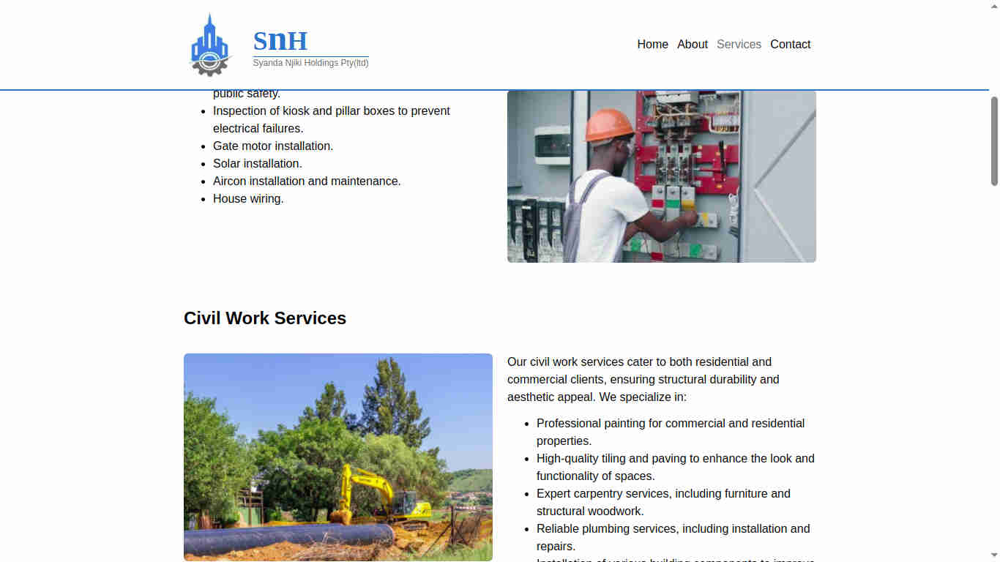
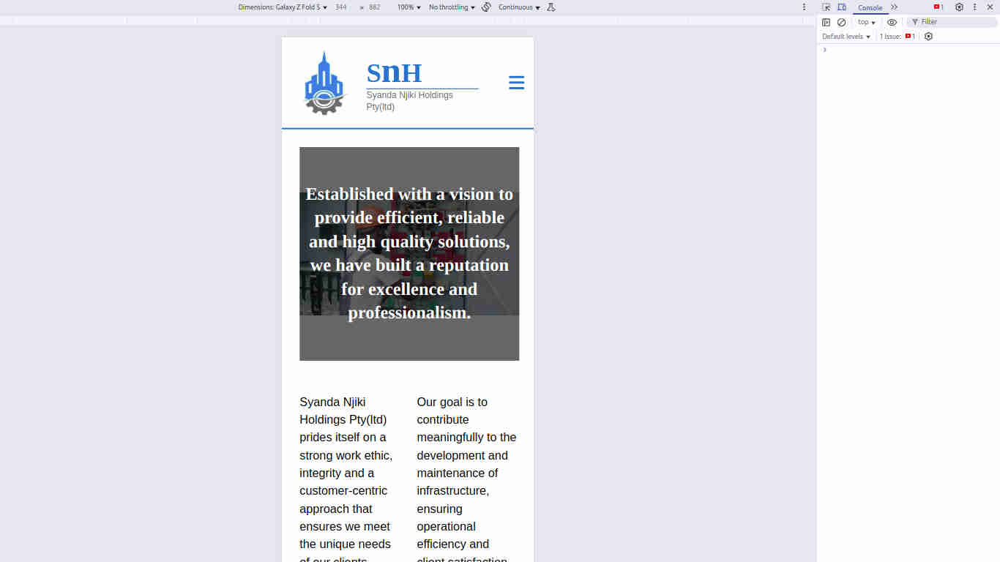
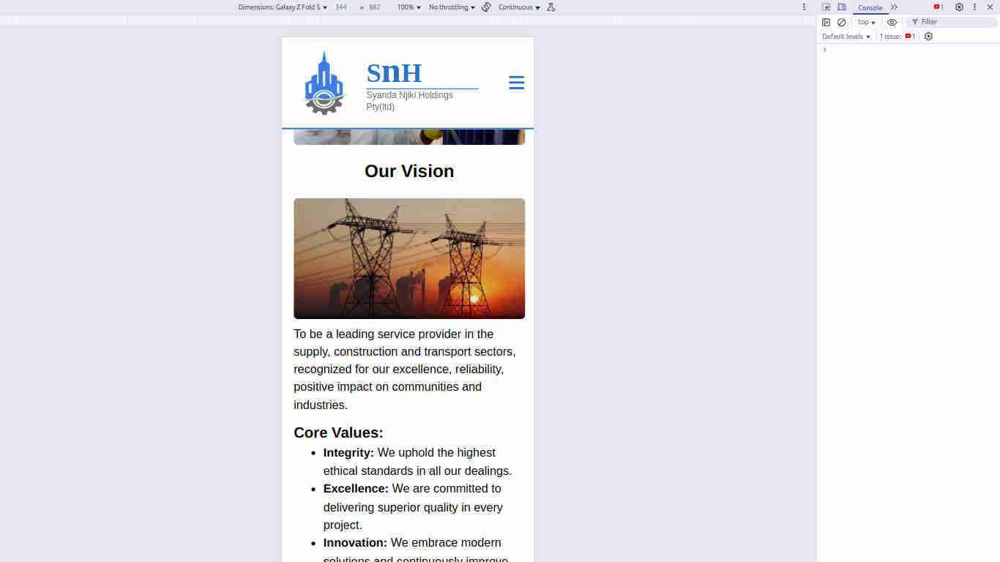
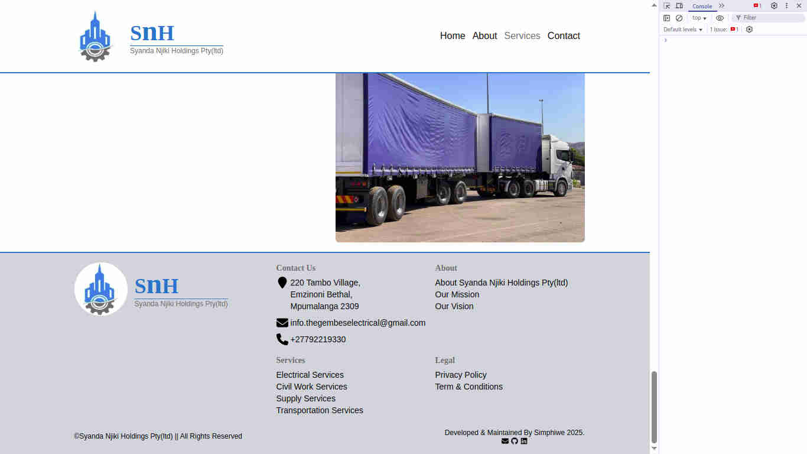

# **Syanda Njiki Holdings**

Check it _**LIVE**_ 👉
**<https://syanda-njiki-holdings.onrender.com/>**

A multi-page website for a startup multi services company in my area, the website is built in modern style using the modern technologies.

## Features

- The website has multiple pages, a home page, about page and services page.
- It's design is responsive suitable for any devices
- It also has dark mode feature which adapts based on the user's device settings.

## Tech stack used

- GIT
- HTML
- CSS
- JavaScript
- React
- Tailwind CSS
- NPM

## Contact

Get in touch:

Email : **<simphiwedladla8@gmail.com>**

Linked: **<https://www.linkedin.com/in/dladla-simphiwe-89061a20a/>**

Github: **<https://github.com/DeeBest>**

